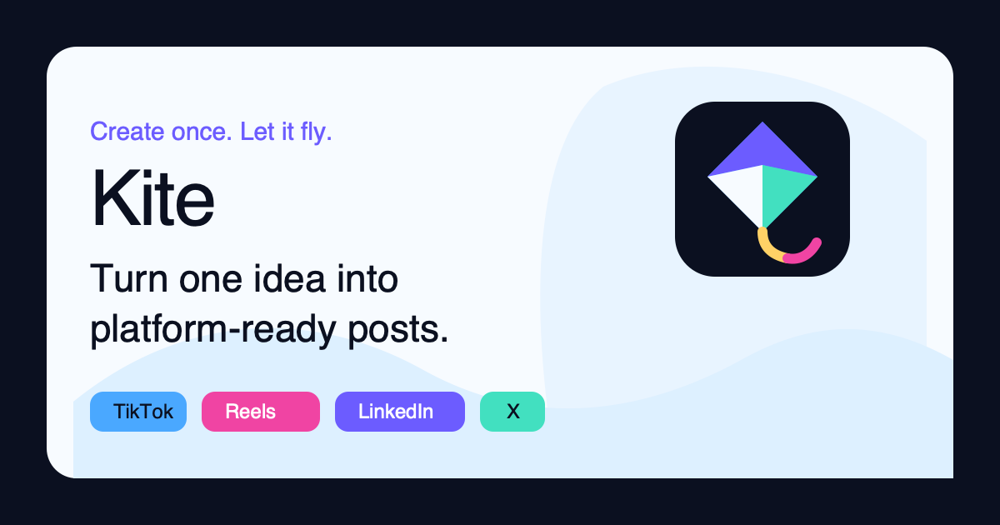
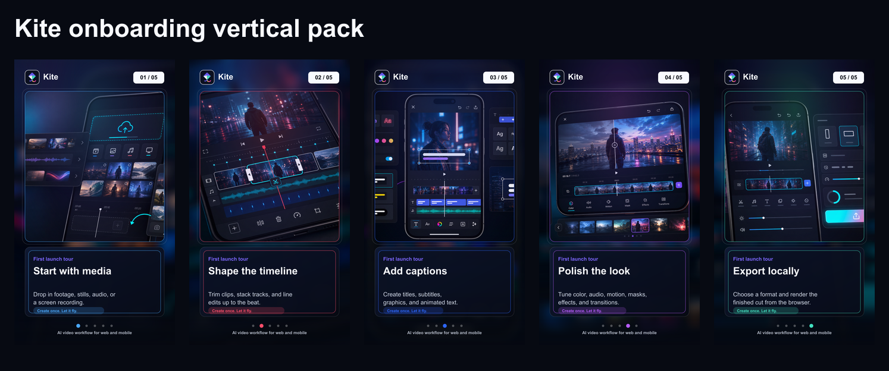

# Kite

> Create once. Let it fly.

Kite is an installable web video editor for creators who want to cut, caption, polish, and export from any device without an app store detour. It runs as a PWA on iOS, Android, tablet, desktop browsers, and now has a macOS desktop shell for local installs.

[Open Kite](https://kitevideo.vercel.app) · [Promo Kit](promo/launch-kit.md) · [Vertical Onboarding Pack](artifacts/kite-onboarding-vertical-pack/README.md)



## The Pitch

No app store. No download. Just edit.

Drop in footage, images, audio, or a screen recording. Shape the timeline, add captions, polish the look, and export locally. Kite keeps the project in the browser-first workflow while still feeling like a product people can install on their phone.

## What Makes Kite Different

- **PWA-first editing**: install Kite from Safari, Chrome, or desktop browsers in a few seconds.
- **Phone-to-desktop workflow**: the same editor language works across mobile, tablet, desktop web, and macOS.
- **Local export focus**: editing and export stay centered on the user's device.
- **AI assist layer**: Kite AI helps shape platform-ready hooks, captions, titles, and post ideas through a server-side proxy so API keys stay private.
- **Creator-ready onboarding**: a visual five-step tour teaches the edit flow before users hit the dashboard.

## Product Story

Kite takes one idea and helps it fly across channels. The editor is built around a simple creator flow:

1. Start with media.
2. Shape the timeline.
3. Add captions.
4. Polish the look.
5. Export locally.



## Features

- Multi-track timeline for video, audio, image, text, and graphics clips.
- Real-time preview with WebCodecs and GPU-accelerated rendering paths.
- Caption, title, shape, SVG, sticker, motion, transition, and effect controls.
- Audio tools including waveforms, ducking, beat sync, noise reduction, and mixer panels.
- Export presets for social formats and local project workflows.
- Mobile editor improvements, mobile export access, and install guidance for iOS and Android.
- Theme-aware Kite branding with dark and light mode.
- PWA manifest, service worker, app icons, favicon, and OG image.
- macOS Electron packaging with `.app`, ZIP, and DMG build scripts.

## Brand Assets

Core Kite assets live in the web public folder:

- Logo mark: [apps/web/public/brand/kite-mark.svg](apps/web/public/brand/kite-mark.svg)
- Social / OG card: [apps/web/public/brand/kite-og.png](apps/web/public/brand/kite-og.png)
- Editor preview: [apps/web/public/brand/kite-editor-preview.svg](apps/web/public/brand/kite-editor-preview.svg)
- App icons: [apps/web/public/icons](apps/web/public/icons)
- Onboarding images: [artifacts/kite-onboarding-vertical-pack](artifacts/kite-onboarding-vertical-pack)

Brand line:

```text
Kite
Create once. Let it fly.
No app store. No download. Just edit.
```

## Run Locally

Requirements:

- Node.js 18+
- pnpm 9+

```bash
pnpm install
pnpm dev
```

Open `http://localhost:5173`.

## Build

```bash
pnpm build
pnpm preview
```

## Deploy To Vercel

The production web app is currently deployed at:

[https://kitevideo.vercel.app](https://kitevideo.vercel.app)

Build command:

```bash
pnpm build
```

Output directory:

```text
apps/web/dist
```

## AI Assistant Setup

The Kite AI assistant calls a server-side Vercel function at `api/ai/assist.ts`. Do not expose provider keys in browser code.

Set these environment variables in Vercel:

```bash
FREELLMAPI_BASE_URL=https://your-router.example.com/v1
FREELLMAPI_API_KEY=your-server-side-key
FREELLMAPI_MODEL=openai/gpt-oss-20b:free
```

Only the Vercel function should see the API key.

## macOS App

Kite also ships as an Electron desktop shell for macOS.

```bash
pnpm desktop:dev
pnpm desktop:dist
pnpm desktop:dist:dir
```

Generated release artifacts are local-only and ignored by Git. For public distribution, sign and notarize the app with an Apple Developer ID.

## Repository Structure

```text
apps/
  web/       React + TypeScript PWA editor
  desktop/   Electron macOS shell
api/
  ai/        Vercel server-side AI proxy
packages/
  core/      Timeline, media, rendering, export engines
  ui/        Shared UI styles
artifacts/
  kite-onboarding-vertical-pack/
promo/
  launch-kit.md
```

## Upstream Credit

Kite is a branded product build based on the MIT-licensed OpenReel Video project. The product direction, PWA onboarding, Kite brand system, AI assistant proxy, mobile editor improvements, and macOS packaging are layered on top of that open-source foundation.

## License

MIT. See [LICENSE](LICENSE).
